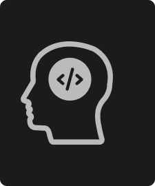
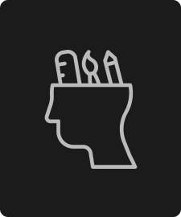

<html>
    <head>
        <meta name="viewport" content="with = device-width, initial-scale=1.0">
        <title>Narco - My Portfolio</title>
        <link rel="stylesheet" href = "Portfolio.css">
        <link rel="stylesheet" href = "Responsive.css">
        <link rel="preconnect" href="https://fonts.gstatic.com"> 
        <link href="https://fonts.googleapis.com/css2?family=Montserrat:ital,wght@0,300;0,400;0,600;0,700;1,300;1,400;1,600;1,700&display=swap">
    </head>
    <body>
        
        <section class="header"><!--logo below here-->
            <nav>
                
                

                    <ul>
                        <li><a href="Home.html">HOME</a></li>
                        <li><a href="about.html">ABOUT ME</a></li>
                        <li><a href="skills.html">SKILLS</a></li>
                        <li><a href="portfolio-sec.html">PORTFOLIO</a></li>
                        <li><a href="contact.html">CONTACT</a></li>
                    </ul>
                

            </nav>
    

        
        

            <video control autoplay width="1440" height="450"><source src='images/logo_edit1.mp4' type = 'video/mp4'></video>
        

     
        

            <h2>
                I'm a
            </h2>
            <h1>
                A STUDENT.
            </h1>
            <a href="about.html" class="ab-btn" onClick="alert('Hello I am Tanishq Nakra');">HELLO</a>

        
    
    

        </section>

        <!--about me section-->

        <section class="am">

        

            <h1>
                About ME
            </h1>
            <pre>
                    I am an Experience Designer who's primary interests are in the
                    areas of animation,branding + poster design with a strategic focus.
       
                    My goal is to combine design and technology with the help of
                    artificial intelligence. I tend to look for inspiration from observation,
                    conversation, and formal design research to stretch my perspective.
                   
                    I originally started with basic editing and programming in my 
                    highschool like using java, sql, after effects, illustrator.No matter what
                    I'm working on, I try to think of how what I'm helping to create fits
                    into a larger system, and continue to question what benifit it has for the user.
                   
                    I want to be able to branch out as an experience designer, allowing
                    myself to learn new and more meaningful ways to solve problems,
                    and new skills that help me turn my ideas into real, and magical
                    experiences.
                   
                    I hope you liked what you see here and would love to chat more
                    about my ongoing work and thinking!
     
            </pre>

            

        

        </section>

        <section>
            
<h1>Interests.</h1>
            
            
            
            
            <h2 class="dev">DEVELOPER</h2>
            <h2 class="des">DESIGNER</h2>
            <h2 class="ed">EDITOR</h2>
            

        </section>

    </body>
</html>